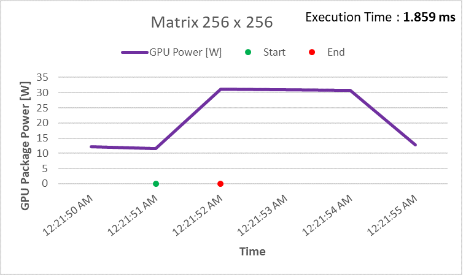

# CPU vs GPU: A Comparative Study of Performance and Power Consumption in Matrix Multiplication
### This repository contains a comparative study of CPU and GPU performance and power consumption in matrix multiplication tasks. The study includes code implementations, results, and analysis of the performance metrics for both CPU and GPU architectures.

## CPU Performance Images

<table>
    <tr>
        <td></td>
        <td></td>
    </tr>
    <tr>
        <td></td>
        <td></td>
    </tr>
</table>

## GPU Performance Images

<table>
    <tr>
        <td></td>
        <td></td>
    </tr>
    <tr>
        <td></td>
        <td></td>
    </tr>
</table>

## Summary and Metrics

